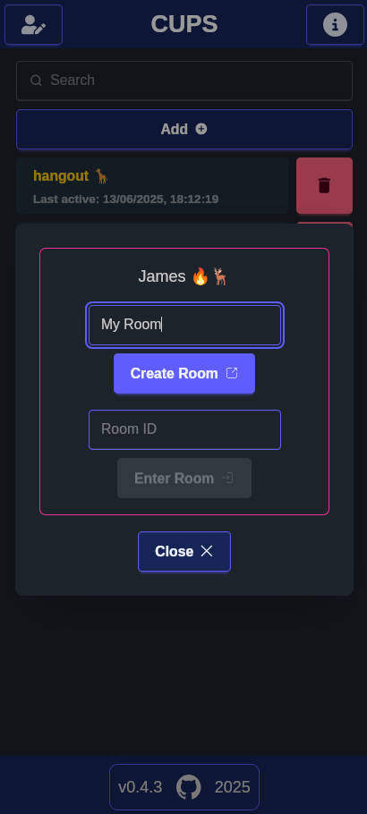
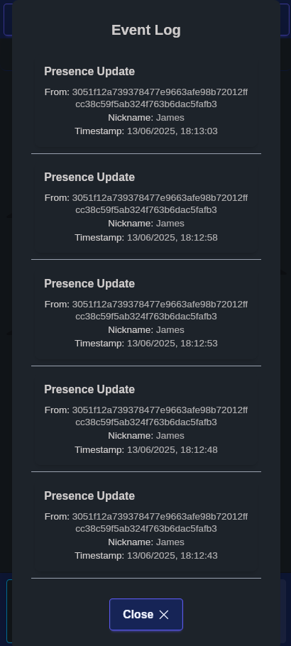

# Iroh/Tauri Peer to Peer Chat App Example

[](https://github.com/jamessizeland/peer-to-peer/actions/workflows/build-android.yml)
[](https://github.com/jamessizeland/peer-to-peer/actions/workflows/build.yml)


## Overview

This is a peer to peer messaging app using the [Iroh Gossip Protocol](https://www.iroh.computer/proto/iroh-gossip) to send messages between peers sharing a Room.

Messages are sent as events to all connected peers directly, are encrypted
as standard and are not persisted anywhere other than on your device.

This is a proof of concept based heavily on the [Iroh Chat Example](https://github.com/n0-computer/iroh-examples/tree/main/browser-chat) and modified for a [Tauri App](https://tauri.app/).

This is designed for mobile first and has been tested heavily on Android.

## Features

- Encrypted messaging
- peer-to-peer messaging, no servers*
- Locally stored visited rooms list
- Locally stored chat history
- Emoji support 🎈🎉
- Messages pushed only to online peers
- Mobile support (Android only, but iOS possible if you have the dev license to compile it)

*beyond Iroh rendezvous servers used for establishing connections

## Getting Started

Check prerequisites:

- <https://v2.tauri.app/start/prerequisites/>
- (Optional) <https://v2.tauri.app/start/prerequisites/#configure-for-mobile-targets>
- <https://bun.sh/docs/installation>

```bash
git clone https://github.com/jamessizeland/peer-to-peer
cd peer-to-peer
bun install
bun tauri dev
```






