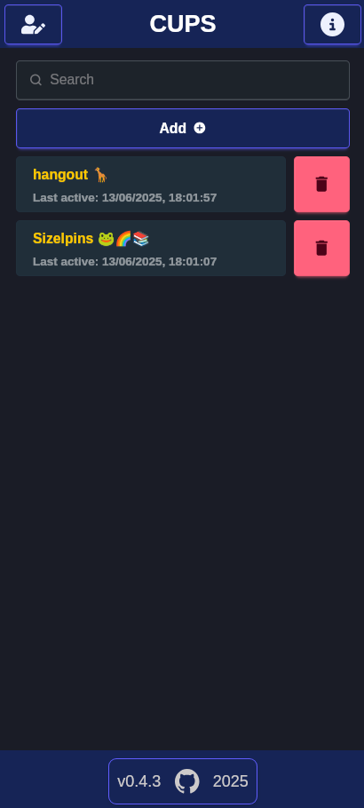
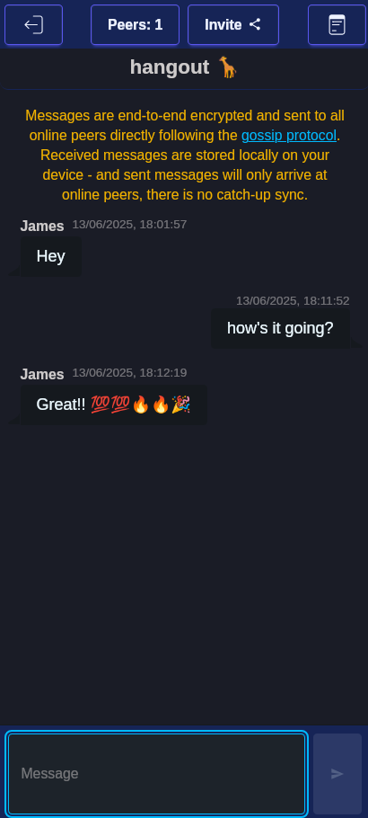

# Iroh/Tauri Peer to Peer Chat App Example

## Overview

This is a peer to peer messaging app using the [Iroh Gossip Protocol](https://www.iroh.computer/proto/iroh-gossip) to send messages between peers sharing a Room.

Messages are sent as events to all connected peers directly, are encrypted
as standard and are not persisted anywhere.

This is a proof of concept based heavily on the [Iroh Chat Example](https://github.com/n0-computer/iroh-examples/tree/main/browser-chat) and modified for a [Tauri App](https://tauri.app/).

## Getting Started

Check prerequisites:

- <https://v2.tauri.app/start/prerequisites/>
- <https://bun.sh/docs/installation>

git clone <https://github.com/jamessizeland/peer-to-peer>
cd peer-to-peer
bun install
bun tauri dev

